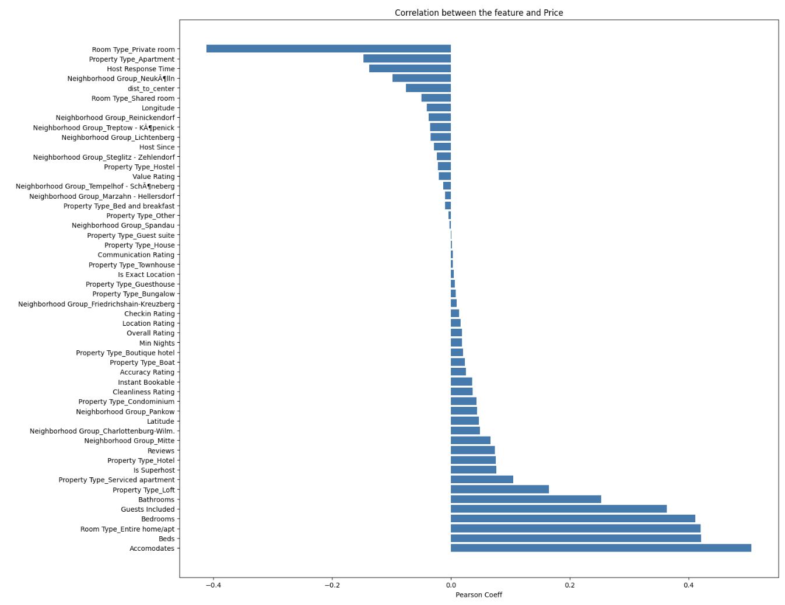
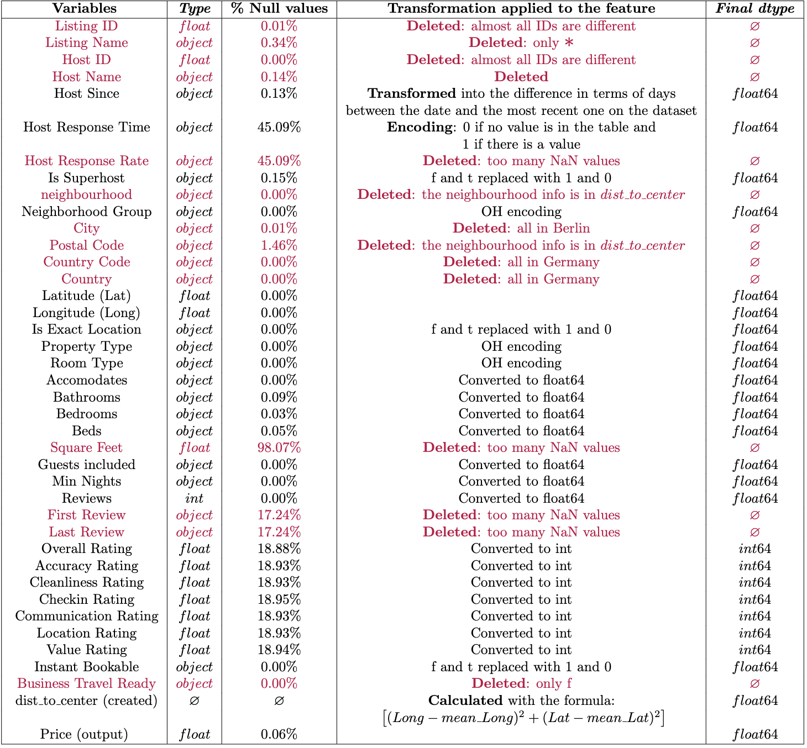
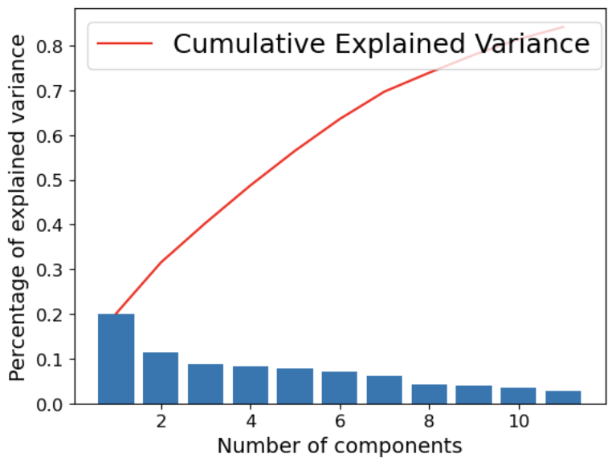

# **Airbnb Berlin Price Prediction Projet**

The project aims to predict the price of a night's accommodation offered on the short-term rental website Airbnb in the city of Berlin. This project is derived from a data challenge proposed by dphi.tech.

**Table of contents:**
1. Folders organization
2. Data analysis & Preprocessing
3. Models

## **1. Folders organization**

- [first approach model](https://gitlab.com/charlotte_sasson/ml-project/-/tree/main/first%20approach%20model) ⇒ folder for our first approach with the model XGBoost. Our first test approach doesn't use the same preprocessing. The folder contains the model xgb.ipynb, two files of utilities and a README.md 
    * we decided to perform a first model (XGBoost), as we know from experience, in tabular competitions, XGB generally performed better than other models (e.g. RandomForest)

    * this first approach enables us to have a first look on our data 
    
    * we have then performed a new preprocessing, due to our discoveries (folder utilities) that will be used for every models we are going to run
 

- [media](https://gitlab.com/charlotte_sasson/ml-project/-/tree/main/media) ⇒ contains all photos and graphs

- [models](https://gitlab.com/charlotte_sasson/ml-project/-/tree/main/models) ⇒ contains four files (trees & boosting, k-nn, k-nn & tree and special_knn) with all the models we ran

- [preprocessing](https://gitlab.com/charlotte_sasson/ml-project/-/tree/main/preprocessing) ⇒ data_cleaning and dimensionality_reduction processes
    

- [utilities](https://gitlab.com/charlotte_sasson/ml-project/-/tree/main/utilities) ⇒ data and results analysis

In order to do the preprocessing of your CSV files you need to go to the folder "data cleaning" in "preprocessing". Then, you need to replace the file paths to your CSVs at the end of data_cleaning.py and launch the file. 
Then, replace your three file paths that you obtained to your CSVs from data_cleaning.py (data_train_path, data_val_path and data_test_path) at the end of dimensionality_reduction.py and launch the file to obtain reduced CSVs of your three files.

## **2. Data analysis & Preprocessing**

We looked at the Pearson’s Coefficients of all features separately regarding their correlation with the feature *Price*. What we obtained is that *Accomodates* seems to be the most linearly correlated with *Price*.

### **Preprocessing Strategy**

### **Dimensionality Reduction**

| Forward Selection with Cross-Validation approach | coef | 
|---|---|
| Beds | 57.4275 | 
| Room Type_Entire home/apt | 27.3036 | 
| Bathrooms | 63.0385 | 
| Guests included | 58.0408 | 
| Property Type_Hotel | 85.3432 |
| Property Type_Loft | 30.6319 | 
| dist_to_center | -41.6857 | 
| Bedrooms | 67.6714 | 
| Neighborhood Group_Charlottenburg-Wilm. | 14.1214 | 
| Is Superhost | 6.7162 | 
| Neighborhood Group_Mitte | 5.7775 | 

* We have studied Best/Forward/Backward selection & PCA for dimensionality reduction. After studying the four methods, we decide to
to use **Forward** stepwise selection with the cross-validation evaluation approach and to reduce our dataset to **11 variables**

* PCA has allowed us to justify our dimensional reduction to a number of variables because these variables allow us to justify more than 80% of the variance

## **3. Models**

| Models | MSE | MAE | RAE | 
|---|---|---|---|
| Decision Tree | X | X |  X |  
| Random Forest | X | X |  |  
| Bagging | X | X |  |  
| Gradient Boosting | X | X |  |  
| AdaBoost | X | X | X |  
| XGBoost | X | X | X | 
| K-NN | X | X | X | 
| K-NN & Tree | X | X |  
| K-NN & XGBoost | X | X |  
